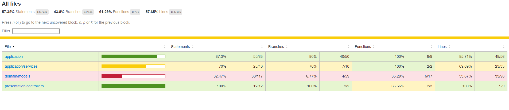

# Resumen de Pruebas Unitarias

Este directorio contiene el resumen de las pruebas unitarias implementadas para el sistema de gestión de candidatos.

## Estructura de las pruebas

- **validateCandidateData.spec.ts**: Pruebas de validación de datos de candidato (campos obligatorios, formatos, estructuras).
- **addCandidate.spec.ts**: Pruebas del servicio de dominio para agregar candidatos (casos exitosos, errores, mocks de modelos).
- **addCandidateController.spec.ts**: Pruebas del controlador Express para agregar candidatos (respuestas HTTP, errores, mocks de Express y servicios).

## Cobertura

La cobertura de código se genera automáticamente con Jest y se encuentra en la carpeta `/coverage`.

## Ejemplo de estructura de carpetas

```
backend/
│
├── src/
│   ├── application/
│   ├── domain/
│   ├── presentation/
│   └── tests/
│       ├── validateCandidateData.spec.ts
│       ├── addCandidate.spec.ts
│       ├── addCandidateController.spec.ts
│       └── setup.ts
│
├── jest.config.js
├── package.json
├── test-summary/
│   └── README.md
└── coverage/
```

## Imágen de pruebas generadas


